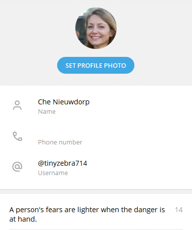

# :busts_in_silhouette: Telegram Randomizer  :busts_in_silhouette:

**Telegram Randomizer is a simple script designed to randomly update telegram account with randomized profile data, random telegram username and a unique AI generated human photo as profile picture.**

## Example :game_die:

## How does it work? :eyes:

The script generates the following fake data: first and last name, age, location and account username using [randomuser](https://randomuser.me/).

User description is randomly picked between a general user description, i.e. *"23. from Hamburg, Germany"* and an inspirational quote from random modern day philosophers such as Kanye West, Breaking Bad characters or classic inspirational quotes using [Kanye quotes API](https://api.kanye.rest/), [Breaking Bad quotes API](https://breaking-bad-quotes.herokuapp.com) and [favqs API](https://favqs.com/).

Finally, a unique AI automated user photo is generated and scraped from the site [this person doesn't exist](https://thispersondoesnotexist.com) and uploaded to user profile.

## Requirements :key:

The script was written with as little as necessary dependecies in mind.

To install the required packages, pip install the [requirements.txt](requirements.txt) file.

APIs used in the script does not require registration except for the [telegram api](https://core.telegram.org/api/obtaining_api_id/).

## License 

[MIT](LICENSE.md)
